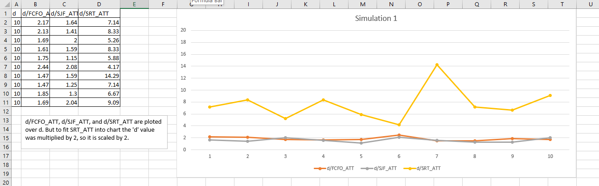
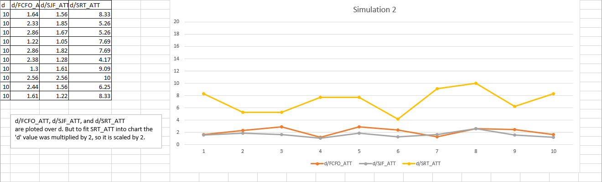
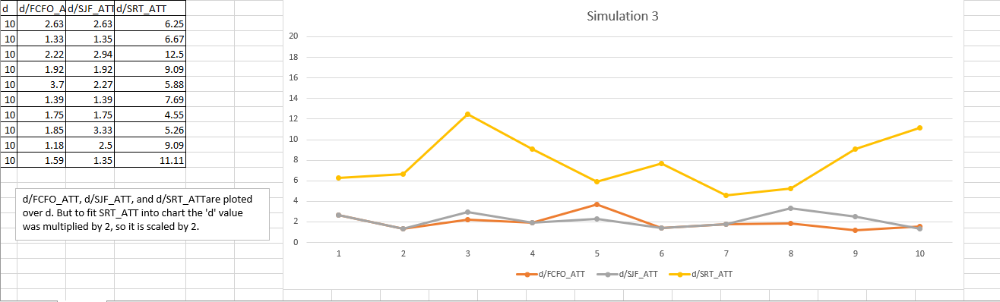
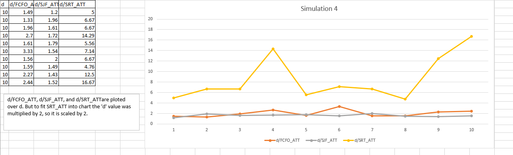

# Summary
    On these graphs we can see that FCFO in general value 'd/ATT' is smaller comparing to 
    SJF and SRT. So, it means that the the overall performance of FCFO is poor.

    For the SJF scheduling algorithm we can see that value 'd/ATT' sometimes
    is little bit smaller and sometimes is little bit larger comparing to FCFO, 
    but much smaller than SRT has. Performance of SRT is about the same as FCFO.
    For FCFO and SJF we can see that CPU utilization is very low.

    For SRT scheduling algorithm we can see that value 'd/ATT' is very high
    comparing to FCFO and SJF. Performance of SRT much better that with FCFO and SJF.
    We can that CPU utilization with the SRT is high.

# Simulations

### Simulation demo video
YouTube video: <https://youtu.be/Lu0SlSFrZ7Q>

### Simulation charts

___

## Simulation: 1

#### Terminal:
    :: ./p_simulation 10 10 100 85.0 10

#### Simulation parameters:
    :: -> n = 10
    :: -> k = 10
    :: -> d = 10
    :: -> d_percentage = 85.0
    :: -> sc = 10

#### CSV output:
    d,d/FCFO_ATT,d/SJF_ATT,d/SRT_ATT
    10.00,2.17,1.64,7.14
    10.00,2.13,1.41,8.33
    10.00,1.69,2.00,5.26
    10.00,1.61,1.59,8.33
    10.00,1.75,1.15,5.88
    10.00,2.44,2.08,4.17
    10.00,1.47,1.59,14.29
    10.00,1.47,1.25,7.14
    10.00,1.85,1.30,6.67
    10.00,1.69,2.04,9.09
___

## Simulation: 2

#### Terminal:
    :: ./p_simulation 10 10 10 50.0 10

#### Simulation parameters:
    :: -> n = 10
    :: -> k = 10
    :: -> d = 10
    :: -> d_percentage = 50.0
    :: -> sc = 10

#### CSV output:
    d,d/FCFO_ATT,d/SJF_ATT,d/SRT_ATT
    10.00,1.64,1.56,8.33
    10.00,2.33,1.85,5.26
    10.00,2.86,1.67,5.26
    10.00,1.22,1.05,7.69
    10.00,2.86,1.82,7.69
    10.00,2.38,1.28,4.17
    10.00,1.30,1.61,9.09
    10.00,2.56,2.56,10.00
    10.00,2.44,1.56,6.25
    10.00,1.61,1.22,8.33
___

## Simulation: 3

#### Simulation parameters:
    :: ./p_simulation 10 10 10 25.0 10

#### Simulation parameters:
    :: -> n = 10 \
    :: -> k = 10 \
    :: -> d = 10 \
    :: -> d_percentage = 25.0 \
    :: -> sc = 10

#### CSV output:
    d,d/FCFO_ATT,d/SJF_ATT,d/SRT_ATT 
    10.00,2.63,2.63,6.25 
    10.00,1.33,1.35,6.67 
    10.00,2.22,2.94,12.50 
    10.00,1.92,1.92,9.09 
    10.00,3.70,2.27,5.88 
    10.00,1.39,1.39,7.69 
    10.00,1.75,1.75,4.55 
    10.00,1.85,3.33,5.26 
    10.00,1.18,2.50,9.09 
    10.00,1.59,1.35,11.11
___

## Simulation: 4

#### Simulation parameters:
    :: ./p_simulation 10 10 10 100 10

#### Simulation parameters:
    :: -> n = 10
    :: -> k = 10
    :: -> d = 10
    :: -> d_percentage = 100.0
    :: -> sc = 10

#### CSV output:
    d,d/FCFO_ATT,d/SJF_ATT,d/SRT_ATT
    10.00,1.49,1.20,5.00
    10.00,1.33,1.96,6.67
    10.00,1.96,1.61,6.67
    10.00,2.70,1.72,14.29
    10.00,1.61,1.79,5.56
    10.00,3.33,1.54,7.14
    10.00,1.56,2.00,6.67
    10.00,1.59,1.49,4.76
    10.00,2.27,1.43,12.50
    10.00,2.44,1.52,16.67
___
